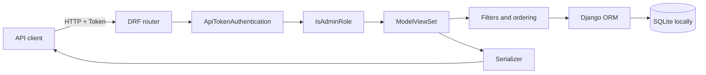
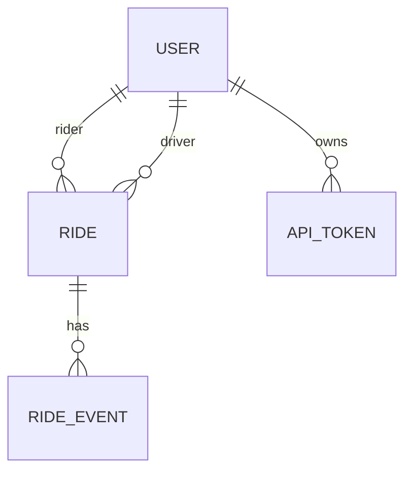

# Architecture

Ride Management API is a single Django service with three REST resources backed by ORM models. DRF's router maps URLs to `ModelViewSet` classes; every viewset applies the same authentication and admin-role boundary.

## Ride-list request lifecycle

1. `ApiTokenAuthentication` validates the header and retrieves `ApiToken` with its user.
2. `IsAdminRole` allows only users whose role is `admin`.
3. `RideViewSet.get_queryset()` composes joined users and a filtered event prefetch.
4. `RideFilter` optionally applies status and rider-email filters.
5. DRF optionally orders by pickup time or ride ID. `sort=distance` instead adds a SQL expression and stable ordering.
6. Page-number pagination counts, slices, and serializes the result.
7. `RideSerializer` returns nested users, recent events, and optional distance.

## Data relationships

## Module boundaries

| Module | Responsibility |
|---|---|
| `authentication.py` | Turn a token header into a project user |
| `permissions.py` | Decide whether the role may access an endpoint |
| `filters.py` | Define supported ride filters |
| `views.py` | Compose queries, validate distance inputs, expose CRUD |
| `serializers.py` | Define nested reads and foreign-key writes |
| `models.py` | Persist entities, relationships, tokens, and indexes |

The domain is small enough that extra repository or service layers would be speculative. If business workflows grow beyond CRUD and query composition, use-case services could be introduced.

## Runtime boundary

The checked-in settings are for local development. Caching, background jobs, external identity, telemetry, and production deployment are outside the current implementation.

